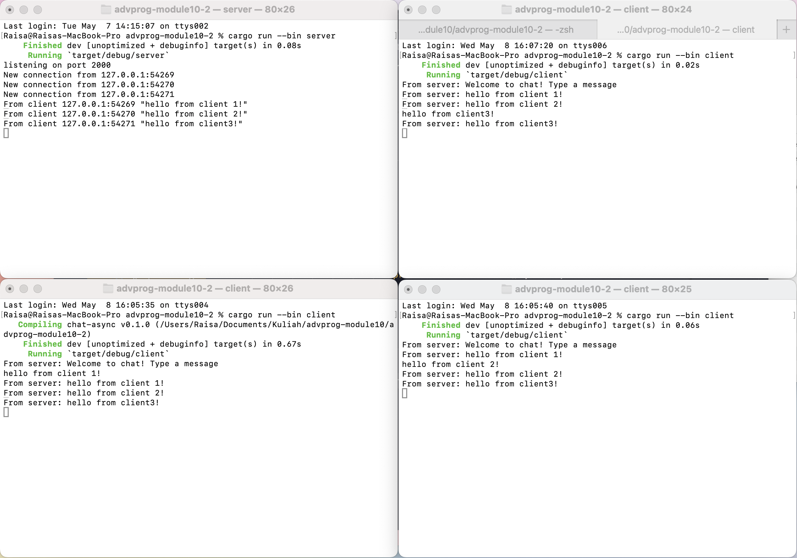
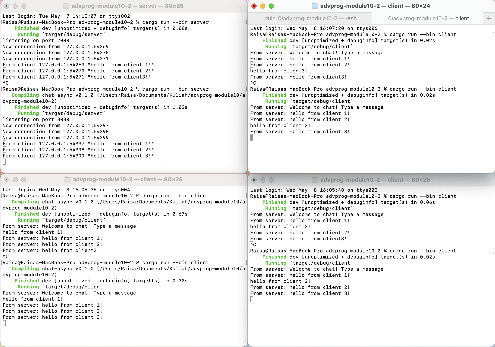
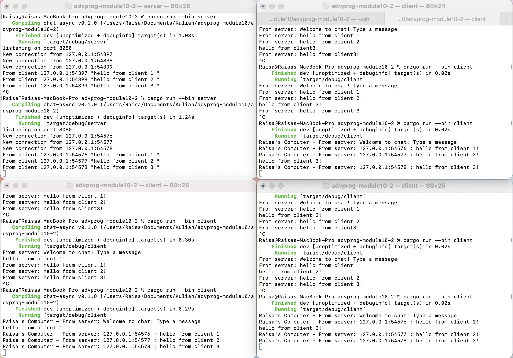

# Tutorial 10 

## 2.1. Original Code of broadcast Chat

After launching both the clients and the server, I proceeded to input messages from each client. The resulting output showcased a broadcast system where all clients and the server received messages from every other client. Upon input, these messages were relayed to the server and then distributed to all clients listening on the same port.

## 2.2. Modifying the Websocket Port

To change the port number, both the server and client configurations need adjustment. If the server and client have different ports, messages will not be distributed to all clients and the server because communication between them would be restricted to their respective ports. Messages sent by clients would be directed to the server's specified port, and the server would only relay messages to clients connected to its designated port.

## 2.3. Small changes, add IP and Port

I changed the broadcasted text format to `bcast_tx.send(format!("{addr} : {text}"))?;`, aimed at embedding the sender's IP and Port details into the message, enhancing message tracking. Additionally, I also changed the sender's name in client.rs within the "Raisa's Computer - From server: {}", text section, enabling identification of message origin and differentiation of message sources. With these changes, the sent messages will include more comprehensive information about the sender, including their IP and Port, providing a better understanding of the message source on both the server and client sides.